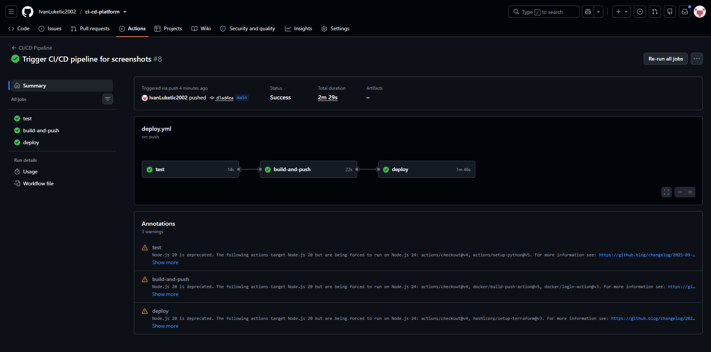
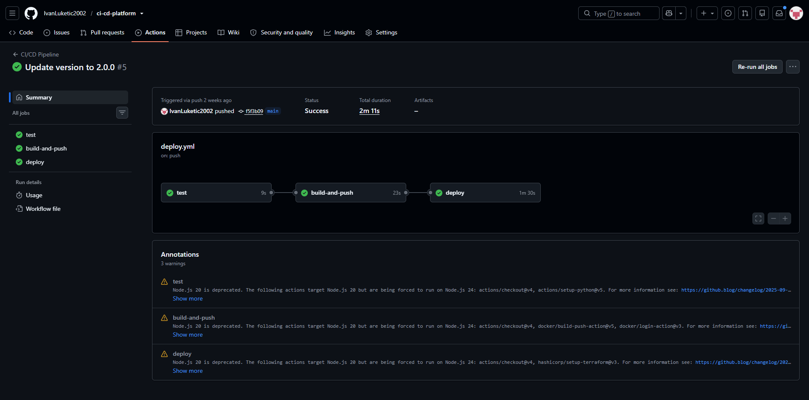

# Cloud CI/CD Platform

Automated CI/CD pipeline simulating real DevOps deployment workflow. Every push to GitHub automatically runs tests, builds a Docker image, provisions AWS infrastructure with Terraform, and deploys the application.

## Screenshots

### Pipeline - All Jobs Green


### Live Application - Auto Deployed


## Architecture

```
GitHub Push
    │
    ▼
GitHub Actions
    ├── Run Tests (pytest)
    ├── Build & Push Docker Image to DockerHub
    └── Terraform Apply (EC2 + Security Group)
            │
            ▼
        EC2 t3.micro
        Docker Container
        FastAPI App :8000
```

## Pipeline Flow

1. Developer pushes code to `main` branch
2. GitHub Actions triggers automatically
3. Tests run with pytest
4. Docker image is built and pushed to DockerHub
5. Terraform provisions EC2 instance on AWS
6. App is deployed via SSH to EC2
7. Application is live at EC2 public IP

## Tech Stack
- **GitHub Actions** - CI/CD pipeline
- **Terraform** - Infrastructure as Code (AWS EC2, Security Group)
- **Docker** - Containerization
- **DockerHub** - Container registry
- **FastAPI** - Demo application
- **pytest** - Automated testing
- **AWS EC2** - Cloud hosting
- **S3** - Terraform remote state

## Infrastructure (Terraform)
- EC2 t3.micro instance
- Security Group (ports 22, 8000)
- S3 backend for Terraform state

## GitHub Actions Jobs

| Job | Trigger | Description |
|-----|---------|-------------|
| test | Push/PR | Run pytest |
| build-and-push | Push to main | Build and push Docker image |
| deploy | After build | Terraform apply + SSH deploy |

## Required GitHub Secrets

| Secret | Description |
|--------|-------------|
| AWS_ACCESS_KEY_ID | AWS credentials |
| AWS_SECRET_ACCESS_KEY | AWS credentials |
| EC2_SSH_KEY | Private key for EC2 SSH |
| DOCKERHUB_USERNAME | DockerHub username |
| DOCKERHUB_TOKEN | DockerHub access token |

## Quick Start

```bash
git clone https://github.com/IvanLuketic2002/ci-cd-platform.git
cd ci-cd-platform

# Add GitHub Secrets (see table above)
# Push to main branch to trigger pipeline
git push origin main
```

## Cost
~$0.01/hour for EC2 t3.micro while running. Run `terraform destroy` after demo.
